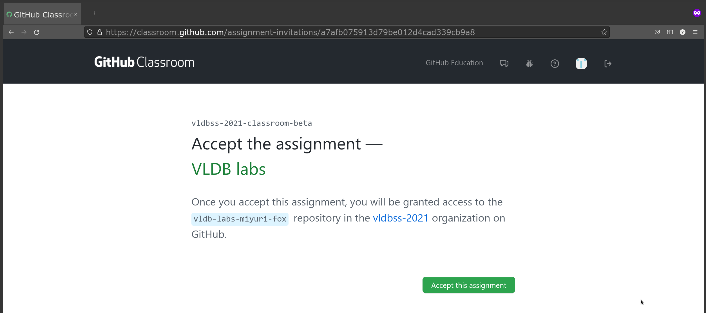
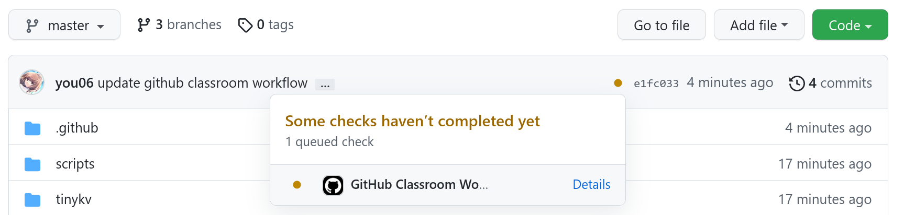
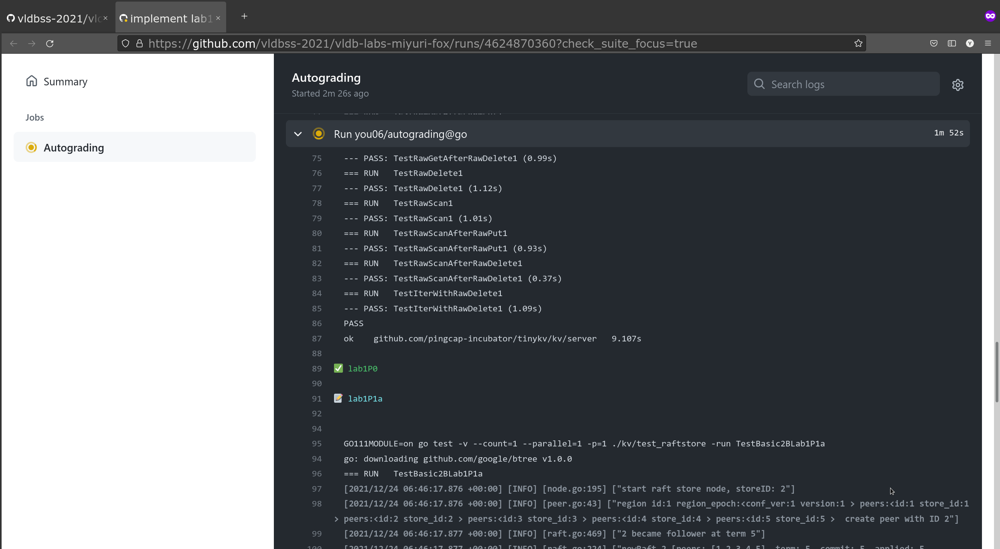

# GitHub Classroom

We use [GitHub classroom](https://classroom.github.com/) to manage the working progress. After joining the classroom, you're able to have your own working repository and the CI will running the test scripts on your commits.

This document talks about the classroom usage.

## Join the Classroom

There is an invitation link for classroom, they look like `https://classroom.github.com/a/hashStr`, visit the invitation link from manager.



## Autograding

Autograding is a workflow which can automatically run test cases. However there are some limitations in Github classroom, in order to make golang works and run it in our self-hosted machines, **you need to overwrite the workflow generated by Github classroom and commit it**.

```sh
cp scripts/classroom.yml .github/workflows/classroom.yml
git add .github
git commit -m"update github classroom workflow"
```

## Commit Your Work

Now you're able to work on your local copy. Once you are ready to try with CI(feel free to use CI), commit your changes and push them to your `master` branch.

There is a symbol on the right of your work, in the image, yellow point means the CI is on going, just the "Details" to check out the output of CI.



Here we meet an un-implement error xD.


After implementing lab1P0, the CI passed 🚀.


