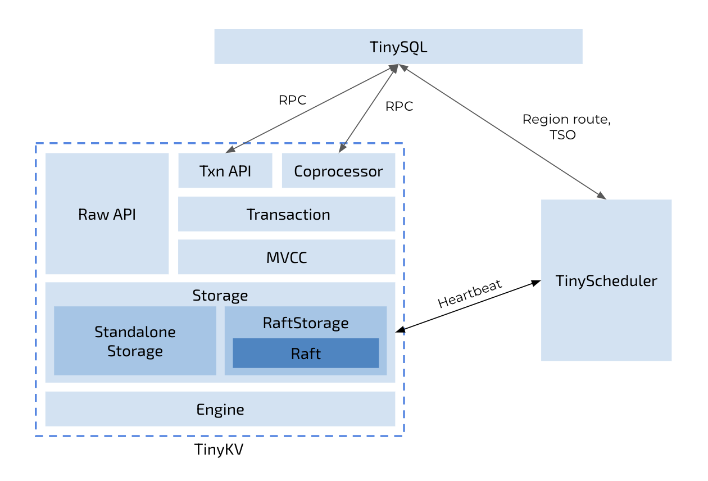

# LAB 1 The Storage And Log Layer.

## The Design

In this chapter, we'll discuss the design of our distributed transactional database system. The overview of the architecture is:



As we know, a transaction system must ensure that properties of **`ACID`** will be held in most situations. How to ensure them?

### Ensure `Durability` first

In the distributed environment, to meet the **availability** and **reliability** requirements, the key point is to improve them for the **transaction logs**. Like what `AWS Aurora` has said "**log is the database**", if the logs are persisted reliably, then the **`Durability`** will be held.

In a single machine database like MySQL, it's achieved by persisting InnoDB redo logs to the disk before return results to the client, obviously the logs could be lost if the single node fails. To persist the logs more reliably, replicas are needed so the distributed system
is introduced. The difficult thing is how to make sure the logs are exactly the same in different replicas. Often we will use some consensus algorithms to replicate logs to different nodes, the `CAP` theory tells us the availability will increase and the possibility of losing logs becomes lower if more replicas are used. 

In the architecture of `tinykv`, `Raft` is used as the consensus algorithm to replicate logs to replica nodes, and the code module is called `raftStore`. 


`raftStore` will be responsible to replicate transaction logs or commit logs to different nodes, after the majority of the replicating members accept the logs successfully,
they are considered `committed` and it's ok to respond to the client the write process could continue. This is the guarantee that once the transaction is committed, then all its write content is persisted to the disk at least on the majority nodes, so the **`Durability`** of transaction `ACID` is held in distributed environments.

With only the commit logs, read and write requests could not be served. The storage engine is used to apply or replay these logs and then it will serve these requests.
In TiKV, [rocksdb](https://docs.pingcap.com/zh/tidb/stable/rocksdb-overview) is used to build the storage engine layer. In tinykv, a similar storage engine [badger](https://github.com/dgraph-io/badger) is used, all the read and write requests will be processed by it. The difficult thing for the storage engine is to make itself as fast as possible while reducing the resources it needs.


### How to make it `Atomic`

In the traditional solution of 
distributed transaction architectures, a special protocol such as `two-phase commit` is used to make sure the transaction processing is atomic. The problem is how to ensure that the transactional progress could continue **correctly** after failover, as in the traditional 2PC processing the whole process will get stuck if the coordinator is not available.

In `tinykv` the `raftStore` has ensured logs will be replicated to replicas, and the failover is much easier that transaction states could always be restored if majority nodes of the raft group survive. That is to say the 2PC processing could continue as the newly elected leaders will always have same transaction states, no matter the coordinator or the participant fails.

In tinysql/tinykv, the [percolator](https://research.google/pubs/pub36726/) protocol is used as the distributed transaction protocol, it's like the traditional 2PC way but still have some differences. One of the main differences is that the coordinator or the scheduler does not need to persist the transaction states locally, all the transaction states are persisted in the participant nodes. In tinysql/tinykv cluster, the `tinysql` nodes work as the transaction coordinators and all the `tinykv` nodes are participants.In the next labs, we'll go to implement the percolator protocol based on the existing framework of `tinysql` and `tinykv`.

### Concurrency And Isolation

To get better performance, a transaction engine will need to process many concurrent requests, how to process them concurrently and ensure the results are reasonable? Isolation levels are defined to describe the tradeoff between performance and concurrency constraints, if you are not familiar with the transaction isolation levels and related concepts, the [document](https://pingcap.com/blog-cn/take-you-through-the-isolation-level-of-tidb-1) could be referred.

In tinysql/tinykv cluster, we're going to implement a strong isolation constraint which is called `snapshot isolation` or `repeatable read`. In the distributed environment,
a global timestamp ordering allocator is used to sequence all the concurrent transactions, and each transaction will have a unique `start_ts` which means the snapshot it uses, this timestamp ordering allocator is in `tinyscheudler` server in the tinysql/tinykv cluster. To learn more about the scheduler service of the cluster, this [document](https://pingcap.com/blog-cn/placement-driver) could be helpful.

### Support SQL Transaction

To build a complete distributed transaction database, we are going to add SQL support for the transaction grammars like `BEGIN`, `COMMIT`, `ROLLBACK`. The generally used write statements like `INSERT`, `DELETE` will be implemented to write data using distributed transactions into the storage layer. The `SELECT` results will also keep the transaction properties described in the above sections. And the transaction layer is able to handle read-write and write-write conflicts correctly.

## LAB1

In this lab, we are going to get familiar with the whole framework in `tinykv`, and complete the implementation of the `raftStore` and `storeEngine`. As described above, the `raftStore` will process all the commit logs and replicate them to different nodes within different raft groups. In tinykv, a raft group is named `Region`, every region has its key ranges it will serve. There will be one region after the bootstrap stage, and the region could be split into more regions in the future, then different raft groups or what we call `regions` in the `raftStore` will be responsible for different key ranges, and `multi-raft` or `multiple-regions` will process client requests independently. By now you could simply regard that there is only one raft group or one region processing requests.
This [document](https://docs.pingcap.com/zh/tidb/stable/tikv-overview) could be helpful to understand the `raftStore` architecture.


### The Code

#### The `raftStore` abstraction

In `kv/storage/storage.go`, there is the interface or abstractions of the `raftStore`.
```
// Storage represents the internal-facing server part of TinyKV, it handles sending and receiving from other
// TinyKV nodes. As part of that responsibility, it also reads and writes data to disk (or semi-permanent memory).
type Storage interface {
	Start(client scheduler_client.Client) error
	Stop() error
	Write(ctx *kvrpcpb.Context, batch []Modify) error
	Reader(ctx *kvrpcpb.Context) (StorageReader, error)
	Client() scheduler_client.Client
}
```
The `Write` interface will be used by the transaction engine to persist the write logs, if it returns ok then the logs have been successfully persisted and applied by the storage engine. Here two steps are needed, the first is to persist the logs on the majority nodes and the second is to apply these writes in the storage engine.

To make it simple, we will skip the raft log consensus step and just consider a single machine storage engine first. After this we will get familiar with the storage engine interfaces, that's very useful as the `raftStore` will use the same storage engine to persist logs too.

#### Implement The Core Interfaces of `StandAloneStorage`

Try to implement the missing code in `kv/storage/standalone_storage/standalone_storage.go`, these code parts are marked with:

`// YOUR CODE HERE (lab1).`

After finishing these parts, run `make lab1P0` command to check if all the test cases are passed. Things to note:
- As the [badger](https://github.com/dgraph-io/badger) is used as the storage engine, the common usages could be found in its documents and repository.
- The `badger` storage engine does not support [`column family`](https://en.wikipedia.org/wiki/Standard_column_family). The column families are needed for the `percolator` transaction model, in `tinykv` the column family related utilities are already wrapped in `kv/util/engine_util/util.go`. When process the `storage.Modify`, the key written into
the storage engine should be encoded using `KeyWithCF` function considering its expected column family. In `tinykv` there are two types of `Modify`, check the `kv/storage/modify.go` for more information.
- The `scheduler_client.Client` will not be used by the`standAloneServer`, so it could be skipped.
- The `txn` features and related read/write interfaces provided by `badger` could be considered. Check about the `BadgerReader` for more information.
- Some test cases could be useful to understand the usages of the storage interface.


#### Implement The Core Interfaces of `RaftStorage`

In the `StandAloneStorage` the log engine layer is ignored, and all the read and write requests are directly processed by the storage engine. In this chapter we'll try to build the log engine as described above. In `standalone_storage` a single badger instance is used as the storage engine.
There will be two `badger` instances in `raftStore`, the first one is used as the storage engine or state machine just like the `standalone_storage`, the second one will be used by the log engine in `raftStore` to persist raft logs. In `kv/util/engine_util/engines.go` you could find `Kv` and `Raft` struct members, the `Kv` instance is used as the storage engine and the `Raft` is used by the raft log engine.

The workflow of the `raftStore` is:


There are some important concepts and abstracts, some of which are already referred to above, the lists are:
- `RawNode`. A wrap of the raft instance, the `Step`, `Ready` and `Advance` interfaces are used by the upper layer to drive the raft process. The `RawNode` and its inner raft instance are not responsible for actually sending messages and persisting logs, they will be set in the result `Ready` struct and the upper layer will process the ready result doing the real work. 
- `Ready`. The ready is the output of the raft instance, they are expected to be processed by the upper layer, for example sending messages to other nodes and persist information to the log engine. More information about `Ready` could be found in the comments in `kv/raft/rawnode.go`.

The above concepts or abstractions are about the raft instance. The following concepts are built above the raft instance or `RawNode`.
- `Region`. A region is a raft group and is responsible for the read/write requests processing related to specific key ranges.
- `Peer`. A peer is a member of a raft group or a region, by default 3 replicas are used and a region will have 3 different peers. A peer will have a `RawNode` inside which contains a raft instance.
- `raftWorker`. The worker to process all the client requests routed to different region leaders or region peers.
- `peerMsgHandler`. The delegate used to process the client requests for a specific leader peer.
- `applyWorker`. After the proposed requests and the related logs are committed, correspond apply requests will be routed to the `applyWorker`, then these logs will be applied to the state machine which is the `badger` storage engine in tinykv.


Putting them together, the message flows could be split into two phases:

- **The log consensus phase**. The client requests are sent to the router with callbacks, `raftWorker` will handle the requests using correspond peer message handler.
- **The log apply phase**. After the logs are committed by the raft group, apply requests will be sent to the apply router, `applyWorker` will handle the apply requests and finally invoke the callbacks and then it's allowed to respond results to the client.

Documents which could be helpful to understand the `raftStore`:
- [raftStore code analysis](https://pingcap.com/blog-cn/tikv-source-code-reading-17)
- [tikv source code reading raft propose](https://pingcap.com/blog-cn/tikv-source-code-reading-2)
- [tikv source code reading raft commit/apply](https://pingcap.com/blog-cn/tikv-source-code-reading-18)

Try to implement the missing code in:
- `kv/raftstore/peer_msg_handler.go`, the `proposeRaftCommand` method, which is the core part of read/write requests proposing.
- `kv/raftstore/peer.go`, the `HandleRaftReady` method, which is the core part of raft ready processing.
- `kv/raftstore/peer_storage.go`, the `SaveReadyState` method, which is core part of the states and logs persistency.
- `kv/raftstore/peer_storage.go`, the `Append` method, it appends the logs from raft ready to the log engine.


These code part entrances are marked with:

`// YOUR CODE HERE (lab1).`

The to be finished code parts are marked with

`// Hintx: xxxxx`

There are some useful comments and guidance around them.


As the `raftStore` is quite complex so the tests are split into 4 parts, there is more information in the `Makefile` file, the order of the tests are:
- `make lab1P1a`. This is about the basic tests of `raftStore` logic.
- `make lab1P1b` with fault injections. This is about the basic tests of `raftStore` logic.
- `make lab1P2a`. This is about the persistency tests of `raftStore`.
- `make lab1P2b` with fault injections. This is about the persistency tests of `raftStore`.
- `make lab1P3a`. This is about the snapshot related tests of `raftStore`.
- `make lab1P3b` with fault injections. This is about the snapshot related tests of `raftStore`.
- `make lab1P4a`. This is about the configuration change tests of `raftStore`.
- `make lab1P4b` with fault injections. This is about the configuration change tests of `raftStore`.

Things to note:
- When the tests failed, there will be some trash directory or files in `/tmp/test-raftstore-xxx`, they could be removed by hand, or the `make clean` command could be used to do the cleanup work.
- The tests may consume much memory, better to use a development machine with RAM(>= 16 GB), if the tests could not run together because of OOM, try to run them one by one using commands like `go test -v ./kv/test_raftstore -run test_name`.
- Try to set bigger open file limits before running the tests, for example `ulimit -n 8192`.
- The raft package provides the raft implementation. It's wrapped into `RawNode` and the `Step` and `Ready` are the core interfaces to use the `RawNode`.
- There will be different kinds of workers in the `RaftStorage`, the most important worker is the `raftWorker` and `applyWorker`.
- Try to understand the whole message processing a new input client request and response to the client with results. As there are different workers and the raft consensus needs several steps, a client request will be possibly forwarded to different workers, also callbacks will be used to notify the caller with results.  
