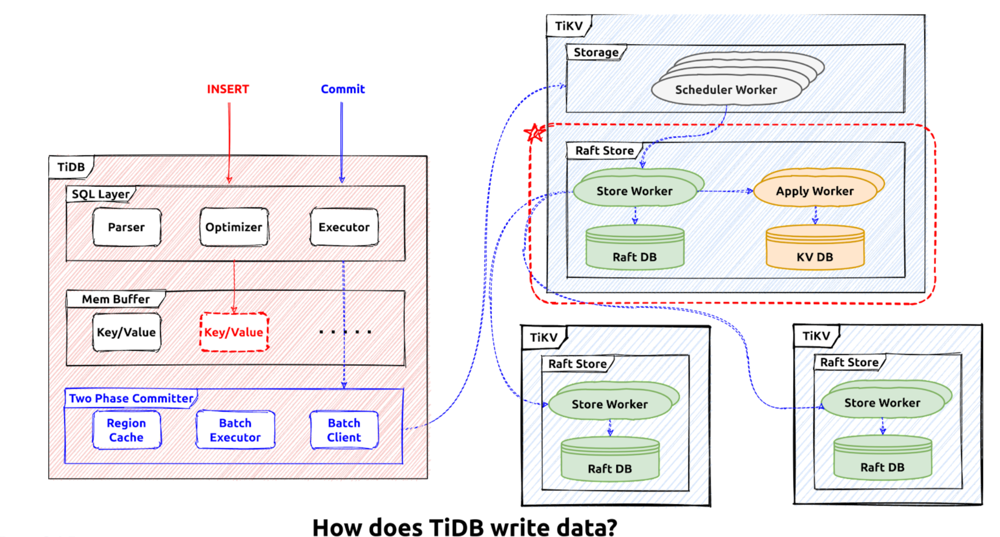
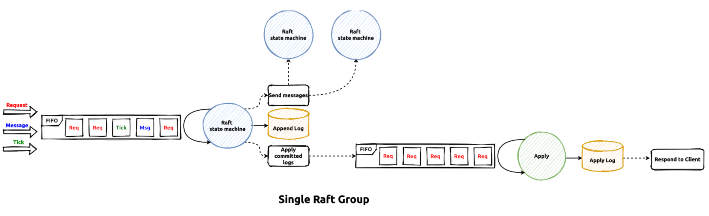

# LAB 2 The Transaction Layer - TinyKV Part

## The Design

In lab 1 we've completed the raft log engine and the storage engine. With the raft log engine, the transaction logs are persisted "reliably" and the states could be restored
after failover.In this chapter, we'll discuss about the design and implementation of the **distributed transaction layer**. The raft log engine has provied the `Durability` and state recover ensurances, the transaction layer needs to gurantee the `Atomicity` and the correctness with concurrencies or `Isolation`. 

The percolator protocol is used to guarantee the `Atomicity`, and to sequence concurrect transactions executions the global timestamp ordering is used. Based on these a strong isolation level which is usually called `Snapshot Isolation` or `Repeatable Read` could be provided for the client. The percolator protocol is implemented in both `tinysql` and `tinykv` servers, and the allocation of global tranaction timestamp is done by the `tinyscheduler` server, and all the logical timestamp is montonically increasing. In this lab we'are going to implement the `tinykv` percolator part, or the distributed transaction participant part.

## Implement Percolator In TinyKV

The transaction processing flow is like this:



The user send write queries for example `Insert` to `tinysql` server, the queries are parsed and executed and the user data is tranformed from rows into key value pairs. 
Then the transaction module is responsible for committing the key value pairs into the storage engine. As different keys may live in different regions which could scatter in different 
`tinykv` servers, the transaction engine must ensure the commit process will **succeed finally** or **do nothing at all**, and here comes the percolator protocol.

Consider commit a distributed transaction with multiple keys.First, one of the to be committed keys will be chosen to act as the **`Primary Key`**, then the transaction status is only determinded by the commit status of this `Primary Key`. In other words, the transcation is considered successfully committed only if the `Primary Key` is committed successfully. The commit process is divided into two phases, the first is `Prewrite` and the second is `Commit`.

### Prewrite Phase

After the key value preparations the transaction comes into the `Prewrite` phase, in this stage all the keys will be prewritted in different `tinykv`
servers containing different region leaders. Each `Prewrite` request will be processed by a `tinykv` server and the `Prewrite Lock` will be put into the `lock column family` for each key in the storage engine. The commit process will fail imediately if any of these prewrite process has failed, any left prewrite locks will be cleaned up afterwars.

### Commit Phase

If all of the prewrite processing are successful, the transaction goes into `Commit` phase, in this stage the `Primary Key` will be committed firstly. The operations of `Commit`
processing are put a `Write Record` into the `write column family` in the storage engine and unlock the `Prewrite Lock` in the `lock column family`. If the commit operation of the primary key has succeed then the transaction is considered committed and the success response will be sent back to the client. All the other keys which are called `Secondary Keys` will be committed **asynchronously** in the background tasks.

In the common path these two pahses are enough, but not doing **crash recovery**. In the distributed environment failures could happend anywhere, for example the `tinysql` servers could fail before the finish of the `Two Phase Commit` and so are the `tinykv` servers. After the new region leader is elected and started to process requests, how should we **recover the unfinished transactions and ensure the correctness**?

### Rollback Record

Once the transaction is decided to fail, its left locks should be cleaned up and a rollback record will be put into storage engine to prevent possible future prewrite or commit(consider the network delay, etc). So if the rollback record is put on the primary key of this transaction, the transaction status is decided to be `Rolled Back` and it
will never commit and must fail.

### Check The Transaction Status

As mentioned above the final status of a transaction is determinded only by the status of the `Primary Key` or `Primary Lock`. So if some transaction status could not be decieded, it's needed to check the status of its `Primary Key` or `Primary Lock`. If there is commit or rollback record for the primary key, then we could safely say the transaction is already committed or rolled back. If the primary lock still exists and it's not expired yet, then the transaction commit is possible still ongoing. If there is no lock record and commit/rollback record, the transaction status is uncertain we could choose to wait or to write a rollback record to prevent the latter commit then it's decided to be rolled back. Each `Prewrite Lock` in the two phase commit will have a `Time To Live` field, if its ttl has expired then the lock could be rolled back by concurrent
commands like `CheckTxnStatus`, after that this transaction must fail finally.

### Process Conflicts And Do Recovery

Different transaction coordinators could be located in different **tinysql** servers, the read and write requests may conflict with each other. Consider the situation that a transaction `txn1` has prewrited a lock on key `k1`, another read transaction named `txn2` is trying to read `k1`, how should the `txn2` deal with it?

The read and write requests could not continue as the lock record has blocked them, there are serveral possibilities:
- The transaction this lock belongs to is already committed, it's ok to commit this lock too, then the blocked requests could continue on this key.
- The transaction this lock belongs to is already rolled back, it's ok to rollback this lock, then the blocked requests could continue on this key.
- The transaction this lock belongs to is still ongoing, the blocked requests has to wait for the blocking transaction to finish.

These conflict processing is called `Resolve` in `tinysql/tinykv` clusters. Once the requets are blocked by a prewrite lock of another transaction, the resolve process will be used to help decide the status of the lock and help commit or rollback this lock, so that the requests could continue. The `Resolve` operations implicitly help doing the **transaction recovery**. Suppose a situation that the transaction scheduler finishes prewrite locks then the `tinysql` server has crashed and these left locks will be resolved
by the concucrent transaction requests from other `tinysql` servers.


## LAB2

We're going to implement the above interface and their processing logic in tinykv server.

### The Code

#### The `Command` Abstraction

In `kv/transaction/commands/command.go`, there is the interfaces for all the transaction commands.

```
// Command is an abstraction which covers the process from receiving a request from gRPC to returning a response.
type Command interface {
	Context() *kvrpcpb.Context
	StartTs() uint64
	// WillWrite returns a list of all keys that might be written by this command. Return nil if the command is readonly.
	WillWrite() [][]byte
	// Read executes a readonly part of the command. Only called if WillWrite returns nil. If the command needs to write
	// to the DB it should return a non-nil set of keys that the command will write.
	Read(txn *mvcc.RoTxn) (interface{}, [][]byte, error)
	// PrepareWrites is for building writes in an mvcc transaction. Commands can also make non-transactional
	// reads and writes using txn. Returning without modifying txn means that no transaction will be executed.
	PrepareWrites(txn *mvcc.MvccTxn) (interface{}, error)
}
```

The `WillWrite` generate the write content need to be written for this request, the `Read` will execute the read requests needed by this command. `PrepareWrites` is used
to build the actual write contents for this command, it's the core part for write command processing. As each transaction may have its unique identifier, the `start_ts` which is the allocated global timestamp, the `StartTs` is
used to return this value of the current command.

Try to understand the whole process of the client requests processing(transaction command processing and `raftStore` log commit/apply). The transaction command results in some write mutations, these mutations will be converted into raft command requests and sent to the `raftStore`, after the propose, commit and apply processing in the `raftStore`, the transaction command is considered successful and results are sent back to the clients.




#### Implement the `Get` Command

`KvGet` is used by the point get execution fetching the value for a specific key, try to implement the missing code in `kv/transaction/commands/get.go`, 
These code parts are marked with:

```
// YOUR CODE HERE (lab2).
```

#### Implement the `Prewrite` and `Commit` Commands

These are the two most important interfaces of our transaction engine, try to implement the missing code in `kv/transaction/commands/prewrite.go` and `kv/transaction/commands/commit.go`.  These code parts are marked with:

```
// YOUR CODE HERE (lab2).
```

Things to note:
- There could be duplicate requests as these commands are sent through rpc requests from tinysql server.
- `StartTS` is the only identifier of one transaction.
- `CommitTS` is the expected commit timestamp for one record.
- Consider the read write conflicts processing.

After finish these two parts, run `make lab2P1` to check if all the tests are passsed.

#### Implement the `Rollback` and `CheckTxnStatus` Commands

`Rollback` is used unlock the key and put the `Rollback Record` for a key. `CheckTxnStatus` is used to query the primary key lock status for a specific transaction. try to implement the missing code in `kv/transaction/commands/rollback.go` and `kv/transaction/commands/checkTxn.go`, These code parts are marked with:

```
// YOUR CODE HERE (lab2).
```
After finish these parts, run `make lab2P2` to check if all the tests are passed. Things to note:
- Consider the situation query lock dose not exist.
- There could be duplicate requests as these commands are sent through rpc requests from tinysql server.
- There are three different respons actions in the `CheckTxnStatusResponse`. `Action_TTLExpireRollback` means the target lock is rolled back as it has expired and `Action_LockNotExistRollback` means the target lock does not exist and the rollback record is written.


#### Implement the `ResolveLock` Command

`Resolve` is used to commit or rollback lock if its related transaction status is certain.Try to implement the missing code in `kv/transaction/commands/resolve.go`, 
These code parts are marked with:

```
// YOUR CODE HERE (lab2).
```

After finish these parts, run `make lab2P3` to check if all the tests are passed. Things to note:
- The transaction status has been decided in the input request parameters.
- The `rollbackKey` and `commitKey` could be helpful.

After all the commands and tests are finished, run `make lab2P4` to check if tests in another suite are passed. In the next lab we'll try to implement the transaction coordinator part for percolator protocol in the `tinysql` server, and all these commands will be used.
